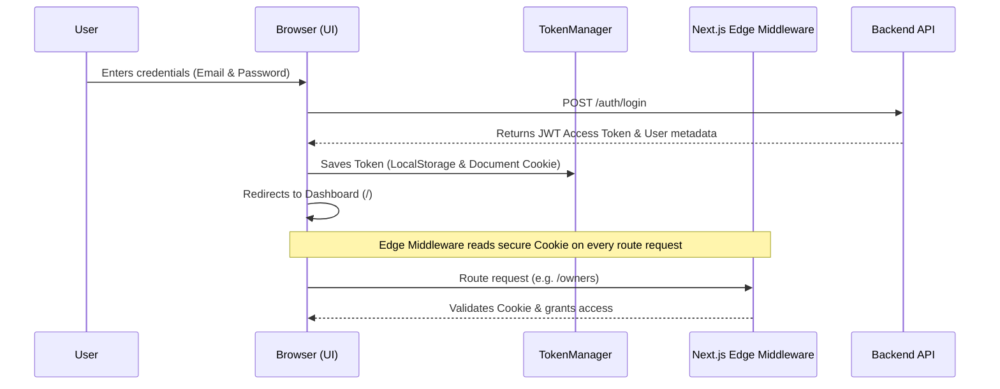

# HomiePG Admin Web Portal - Developer Documentation

This repository contains the Next.js administration dashboard frontend client for the **HomiePG Paying Guest SaaS Platform**.

---

## 1. Enterprise Folder Structure

```
websites/admin-web/src/
  ├── api/              # Axios query client configurations
  │   ├── axios.ts      # Axios default configuration limits
  │   ├── apiClient.ts  # Client entrypoint exporting interceptors
  │   ├── endpoints.ts  # Centralized REST API endpoints mapping
  │   └── interceptors.ts # Bearer token injectors & 401 redirection listeners
  ├── app/              # Next.js App Router folders
  │   ├── login/        # Sign in form views
  │   ├── owners/       # KYC profiles inspection
  │   ├── properties/   # Property lists and verification actions
  │   └── layout.tsx    # Master layouts wrapping Auth Providers and Warning dialogs
  ├── config/           # Central constants and environment validations
  │   ├── env.ts        # Zod env parameters validator
  │   ├── routes.ts     # groups guest, public, and protected routes arrays
  │   └── auth.ts       # inactivity limits and storage keys
  ├── contexts/         # Authentication React context provider
  │   └── auth-context.tsx 
  ├── features/
  │   └── authentication/ # Module features encapsulation
  │       ├── components/ # SessionWarning.tsx countdown modal
  │       └── utils/      # TokenManager and tabSync sync listeners
  ├── hooks/            # Reusable custom hooks
  │   └── useAuth.ts    # Exposes currentUser, hasPermission, login, logout
  ├── middleware.ts     # Next.js Server-side Edge Middleware route guard
  └── types/            # TypeScript schema types matching backend
```

---

## 2. Authentication Flow & Token Lifecycles



---

## 3. Session Lifecycle & Inactivity Timeout

To protect administrative accounts in coliving locations, we implement a strict **Inactivity Timeout** check:
1. **Telemetry Listeners**: The system listens to user actions (`scroll`, `keydown`, `click`, etc.) to continuously refresh session timers.
2. **Inactivity Warning (14th Minute)**: If no actions occur for 14 minutes, the `SessionWarning` countdown modal triggers, prompting:
   * **Extend Session**: Refreshes JWT token signatures offline and resets timers.
   * **Logout**: Purges JWT configurations and routes to `/session-expired`.
3. **Multi-Tab Sync**: When a user logs out or session expires in one browser tab, the storage listener syncs the deletion instantly and redirects all other open browser tabs to `/session-expired`.

---

## 4. Permission System & RBAC (Role-Based Access Control)

The frontend exposes granular checks using the `useAuth()` hook:
* **`currentUser`**: Details of active user.
* **`currentRole`**: User role (`ADMIN` | `OWNER` | `MANAGER` | `USER`).
* **`hasPermission(permission)`**: Evaluates authorization grids:
  * `ADMIN`: Access to all scopes.
  * `OWNER`: Permissions for `property.create`, `property.update`, `bed.assign`.
  * `MANAGER`: Permissions for `property.read`, `complaint.resolve`, `tenant.read`.
* **`canAccess(path)`**: Edge/route check blocking unauthorized roles from path routes.
